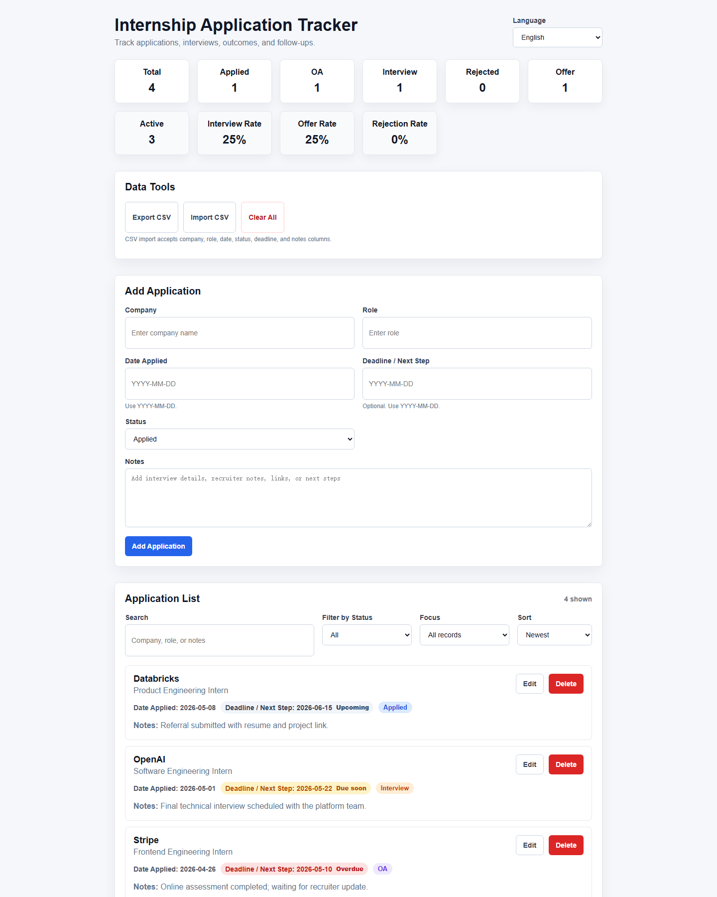

# Internship Application Tracker

A multilingual React + TypeScript app for tracking internship applications, interviews, outcomes, and follow-up dates.

Live demo: https://wylasktg.github.io/Internship-Application-Tracker/



## Features

- Add, edit, delete, search, filter, and sort internship applications
- Track company, role, date applied, status, deadline / next step, and notes
- View summary cards for total applications and each status
- View active application count plus interview, offer, and rejection rates
- Focus the list on active applications, upcoming deadlines, overdue items, or records missing notes
- Highlight deadlines that are upcoming, due soon, or overdue
- Switch between English, Chinese, Japanese, and French
- Save application data locally with `localStorage`
- Export applications to CSV for backup
- Import applications from CSV
- Clear all saved data with confirmation
- Deploy automatically to GitHub Pages through GitHub Actions

## Tech Stack

- React
- TypeScript
- Vite
- CSS
- GitHub Actions
- GitHub Pages

## Project Structure

```text
src/
  components/
    AppHeader.tsx
    ApplicationForm.tsx
    ApplicationItem.tsx
    ApplicationList.tsx
    DataTools.tsx
    SummaryCards.tsx
  utils/
    csv.ts
    dates.ts
    storage.ts
  App.css
  App.tsx
  i18n.ts
  main.tsx
  types.ts
```

## Local Development

Install dependencies:

```bash
npm install
```

Start the development server:

```bash
npm run dev
```

Build for production:

```bash
npm run build
```

Run lint checks:

```bash
npm run lint
```

## CSV Format

An example import file is available at:

```text
examples/applications.csv
```

CSV import supports these columns:

```text
company,role,date,status,deadline,notes
```

Required fields:

- `company`
- `role`
- `date`
- `status`

Dates should use:

```text
YYYY-MM-DD
```

Supported status values:

- `Applied`
- `OA`
- `Interview`
- `Rejected`
- `Offer`

## Data Privacy

This app stores data in the user's browser through `localStorage`. Data does not sync across devices and is not sent to a server. Use CSV export to create backups.
